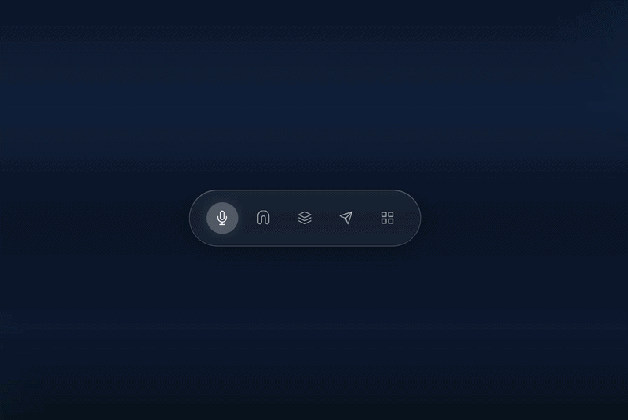

# 03-Apple-Liquidglass-Navbar

A premium, high-performance navigation bar featuring **Liquid Morphing** physics and **Glassmorphism** aesthetics. This component is built with 100% Vanilla JavaScript to ensure sub-millisecond interaction times and zero external dependencies.

[](https://opensource.org/licenses/MIT)


###  Live Preview

+63

### Features

* **Liquid Logic:** Custom "gooey" physics using SVG filters that allow the active indicator to stretch and snap organically between items.
* **Apple-Inspired Glassmorphism:** Deep translucency using `backdrop-filter`, radial gradients, and precise edge-lighting highlights.
* **Zero-Flicker Initialization:** Smart "Silent Init" logic that prevents layout shifts or "shrinking" animations on page reload.
* **Ultra-Lightweight:** Optimized for performance; no heavy libraries like GSAP or Framer Motion required.
* **Sub-millisecond Interaction:** Direct DOM manipulation for instant tactile feedback.

### Technical Breakdown

#### The "Gooey" Physics
The liquid effect is achieved by applying a Gaussian Blur to the moving elements and then sharpening the alpha channel using a color matrix. This creates a "surface tension" effect where elements appear to melt into one another.

```xml
<filter id="gooey-filter">
    <feGaussianBlur in="SourceGraphic" stdDeviation="7" result="blur" />
    <feColorMatrix in="blur" mode="matrix" values="1 0 0 0 0  0 1 0 0 0  0 0 1 0 0  0 0 0 19 -9" result="gooey" />
    <feComposite in="SourceGraphic" in2="gooey" operator="atop"/>
</filter>