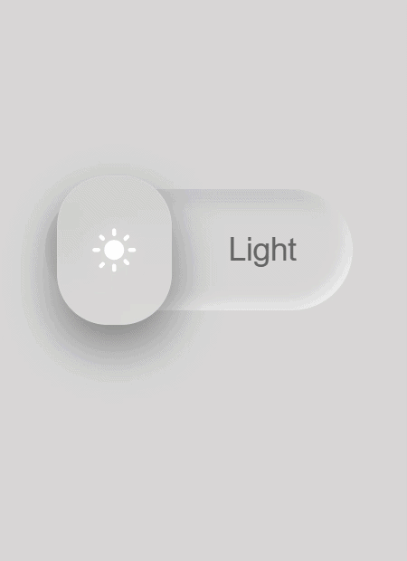

#  Liquid Glass Toggle Theme UI

A high-end, minimalist theme switcher featuring **Liquid Glass** aesthetics and **Glassmorphism** effects. This project focuses on realistic light refraction, frosted-glass blurs, and smooth micro-interactions.

###  Live Preview

###  Features
- **Liquid Glass Aesthetics:** Realistic depth and blur using pure CSS filters.
- **Smooth Micro-interactions:** Fluid transitions between Light and Dark modes.
- **Glassmorphism UI:** Frosted-glass effect with subtle borders and shadows.
- **Responsive & Lightweight:** Built with zero external libraries for maximum performance.

### Tech Stack
- **HTML5:** Semantic structure.
- **CSS3:** Custom properties (variables), `backdrop-filter`, and advanced transitions.
- **JavaScript:** Minimal logic for theme state management.

