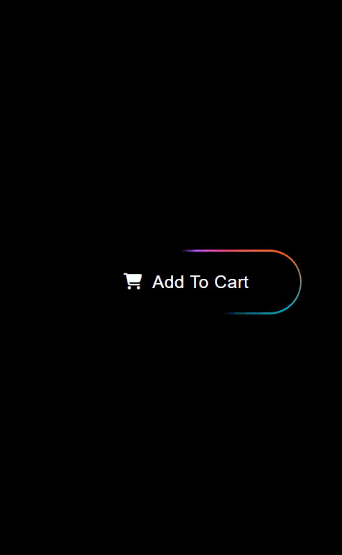

# Glow Border "Add To Cart" Button

A premium, high-fidelity UI component featuring a **Dynamic Glow Border** and sleek **Dark Mode** aesthetics. This project showcases advanced CSS animation techniques to create a liquid-like, neon light trail that orbits the call-to-action button.

### Animation Preview

### Key Features
- **Dynamic Glow Trace:** A continuous, multi-color gradient border that moves fluidly around the button.
- **Minimalist Dark UI:** Optimized for high-contrast environments with a focus on readability and modern aesthetics.
- **Glassmorphism Influences:** Subtle transparency and sharp typography for a "high-end tech" feel.
- **Pure CSS Performance:** High-performance animations achieved without heavy JavaScript or external libraries.

### Design Concepts
- **Linear Gradient Strokes:** Utilizing rotating conic-gradients or animated stroke-dasharrays to simulate movement.
- **Micro-interactions:** Designed to draw user attention naturally toward the conversion goal (Add to Cart).
- **Reflective Accents:** The glow trail mimics light refracting along the edge of a glass-like surface.

### Tech Stack
- **HTML5:** Semantic structure for e-commerce elements.
- **CSS3:** Advanced animations, `linear-gradient`, `box-shadow` glows, and border-radius manipulation.
- **JavaScript (Optional):** Can be used for click-state feedback or shopping cart integration.

### How to Use
1. Clone the repository.
2. Link the `style.css` to your HTML file.
3. Apply the `.glow-button` class to any CTA button.