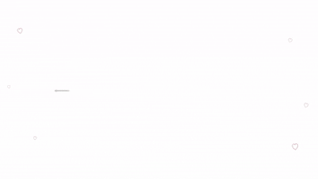

# ThreadAnimation

## Overview

`ThreadAnimation` is an animated, embroidery-styled navigation component for React. A thread stitches itself across the screen — sewing loops and hearts as it goes — popping each of your icons and labels into place along the way. It's fully data-driven and background-independent, so it drops into any layout without bringing its own styling assumptions.

## Preview 



## Features

- Data-driven — pass your own icons, no bundled icon set
- Background-independent — renders only itself, no page-level styling
- Fully customizable via props (colors, sizes, fonts, speed, direction)
- Automatic label collision avoidance, no manual spacing required
- Responsive at every viewport width
- Respects `prefers-reduced-motion`
- SSR-safe and compatible with frameworks such as Next.js and Remix.

## Installation

Copy the three component files into your project:

- `ThreadAnimation.jsx`
- `useThreadAnimation.js`
- `ThreadHelpers.js`

No other dependencies are required beyond `react` and `react-dom`.

## Quick Start

```jsx
import ThreadAnimation from './ThreadAnimation';
import { Github, Linkedin, Mail } from 'lucide-react';

const icons = [
  { id: 'github', label: 'GitHub', href: 'https://github.com', icon: <Github size={18} />, type: 'loop' },
  { id: 'linkedin', label: 'LinkedIn', href: 'https://linkedin.com', icon: <Linkedin size={18} />, type: 'loop' },
  { id: 'contact', label: 'Contact', href: 'mailto:hello@example.com', icon: <Mail size={18} />, type: 'heart' }
];

export default function App() {
  return <ThreadAnimation icons={icons} />;
}
```

## How to Use

1. Build an `icons` array. Each item needs:
   - `id` — a unique key
   - `label` — text shown beneath the icon
   - `href` — link target
   - `icon` — any React node (SVG, icon component, emoji, etc.)
   - `type` — `'loop'` or `'heart'`, the stitch shape sewn around that icon
2. Pass it to `<ThreadAnimation icons={icons} />`.
3. Memoize the `icons` array with `useMemo` if it's built inline — the thread path rebuilds whenever the array reference changes.
4. Place the component anywhere; it takes on its container's width (up to a default max) and adds no background of its own.

## Props

| Prop | Type | Default | Description |
|---|---|---|---|
| `icons` | `Array<{ id, label, href, icon, type }>` | `[]` | Navigation items. `icon` is any React node; `type` is `'loop'` or `'heart'`. |
| `threadColor` | `string` | `'#b3122e'` | Color of the stitched thread. |
| `threadThickness` | `number` | `3` | Thread stroke width in pixels. |
| `needleColor` | `string` | `'#dcdcdc'` | Color of the animated needle. |
| `needleVisible` | `boolean` | `true` | Whether the needle is shown while stitching. |
| `iconSize` | `string \| number` | `'46px'` | Diameter of each icon's circular patch. A bare number is treated as pixels. |
| `iconBgColor` | `string` | `'#fffaf9'` | Background color of each icon's patch. |
| `iconBorderColor` | `string` | `'#b3122e'` | Border color of each icon's patch. |
| `labelColor` | `string` | `'#2a1a1a'` | Text color of labels. |
| `labelFontFamily` | `string` | `"'Caveat', cursive"` | Font family used for labels. |
| `labelFontSize` | `string` | `'1.2rem'` | Base font size for labels (scales down automatically on narrow screens). |
| `speed` | `number` | `4800` | Duration of one full stitching pass, in milliseconds. |
| `direction` | `'rtl' \| 'ltr'` | `'rtl'` | Direction the thread sews in. |
| `autoplay` | `boolean` | `true` | Start stitching automatically on mount. When `false`, animation starts the first time the component scrolls into view. |
| `loop` | `boolean` | `false` | Replay the animation continuously after each pass completes. |

## Minimal Working Example

```jsx
import ThreadAnimation from './ThreadAnimation';

const icons = [
  { id: 'home', label: 'Home', href: '/', icon: <span>🏠</span>, type: 'loop' },
  { id: 'about', label: 'About', href: '/about', icon: <span>✨</span>, type: 'heart' }
];

export default function App() {
  return <ThreadAnimation icons={icons} />;
}
```

## Complete Example

```jsx
import { useMemo } from 'react';
import ThreadAnimation from './ThreadAnimation';
import { Github, Linkedin, Briefcase, Mail, FileText } from 'lucide-react';

export default function SiteNav() {
  const icons = useMemo(() => [
    { id: 'github', label: 'GitHub', href: 'https://github.com/yourname', icon: <Github size={20} />, type: 'loop' },
    { id: 'linkedin', label: 'LinkedIn', href: 'https://linkedin.com/in/yourname', icon: <Linkedin size={20} />, type: 'loop' },
    { id: 'portfolio', label: 'Portfolio', href: '/portfolio', icon: <Briefcase size={20} />, type: 'heart' },
    { id: 'resume', label: 'Résumé', href: '/resume.pdf', icon: <FileText size={20} />, type: 'loop' },
    { id: 'contact', label: 'Contact', href: 'mailto:hello@yourname.dev', icon: <Mail size={20} />, type: 'loop' }
  ], []);

  return (
    <div style={{ padding: '4rem 2rem' }}>
      <ThreadAnimation
        icons={icons}
        threadColor="#b3122e"
        iconSize="52px"
        labelColor="#2a1a1a"
        speed={4800}
      />
    </div>
  );
}
```

## Advanced Example

Combines thread, needle, icon, label, and animation-behavior props together — a dark-themed, left-to-right, looping nav that only starts once scrolled into view:

```jsx
import { useMemo } from 'react';
import ThreadAnimation from './ThreadAnimation';
import { Github, Linkedin, Briefcase, Mail, FileText } from 'lucide-react';

export default function AdvancedNav() {
  const icons = useMemo(() => [
    { id: 'github', label: 'GitHub', href: 'https://github.com/yourname', icon: <Github size={20} />, type: 'loop' },
    { id: 'linkedin', label: 'LinkedIn', href: 'https://linkedin.com/in/yourname', icon: <Linkedin size={20} />, type: 'loop' },
    { id: 'portfolio', label: 'Portfolio', href: '/portfolio', icon: <Briefcase size={20} />, type: 'heart' },
    { id: 'resume', label: 'Résumé', href: '/resume.pdf', icon: <FileText size={20} />, type: 'loop' },
    { id: 'contact', label: 'Contact', href: 'mailto:hello@yourname.dev', icon: <Mail size={20} />, type: 'loop' }
  ], []);

  return (
    <div style={{ background: '#111', padding: '4rem 2rem' }}>
      <ThreadAnimation
        icons={icons}
        // thread
        threadColor="#e8c848"
        threadThickness={2.5}
        // needle
        needleColor="#f4f4f4"
        needleVisible={true}
        // icon patches
        iconSize="52px"
        iconBgColor="#1a1a1a"
        iconBorderColor="#e8c848"
        // labels
        labelColor="#f4f4f4"
        labelFontFamily="'Caveat', cursive"
        labelFontSize="1.3rem"
        // animation behavior
        speed={5200}
        direction="ltr"
        autoplay={false}
        loop={true}
      />
    </div>
  );
}
```

## Responsiveness

- The stage scales fluidly to its container's width, up to a default `max-width` of `980px`; the SVG thread scales with it, redrawing proportionally at any size.
- Icon positions are percentage-based, so they stay correctly placed along the thread at every viewport width.
- Labels are re-checked for overlap on resize: if the available space changes enough for two labels to collide, they're automatically redistributed — no manual breakpoint tuning needed.
- At viewport widths of `640px` and below, icon size and label font size both scale down automatically.
- Users with `prefers-reduced-motion` enabled see the finished embroidery immediately, with no stitching or pop-in animation.

## Customization

Every visual and behavioral aspect is controlled through props:

- **Colors** — `threadColor`, `needleColor`, `iconBgColor`, `iconBorderColor`, `labelColor`.
- **Thread** — `threadThickness`.
- **Needle** — `needleColor`, `needleVisible`.
- **Icon size** — `iconSize`.
- **Labels / fonts** — `labelColor`, `labelFontFamily`, `labelFontSize`.
- **Animation speed and behavior** — `speed`, `direction`, `autoplay`, `loop`.
- **Content** — `icons`; no icon set is bundled, so any icon library or custom SVG works.

All props are optional; omitting any of them falls back to the defaults listed in the Props table.

## Notes

- No default icon set is bundled — `icons` must be supplied for the component to render anything.
- Memoize the `icons` array (`useMemo`) if it's constructed inline; the component rebuilds the thread path whenever the array reference changes.
- Component styles are injected into `document.head` once per page, not via external CSS files.
- The component renders only the thread/icon/label navigation itself — it has no page background and does not affect surrounding layout.
- Built with `useLayoutEffect`, which falls back to `useEffect` during server rendering, so it's safe to use with Next.js or Remix.