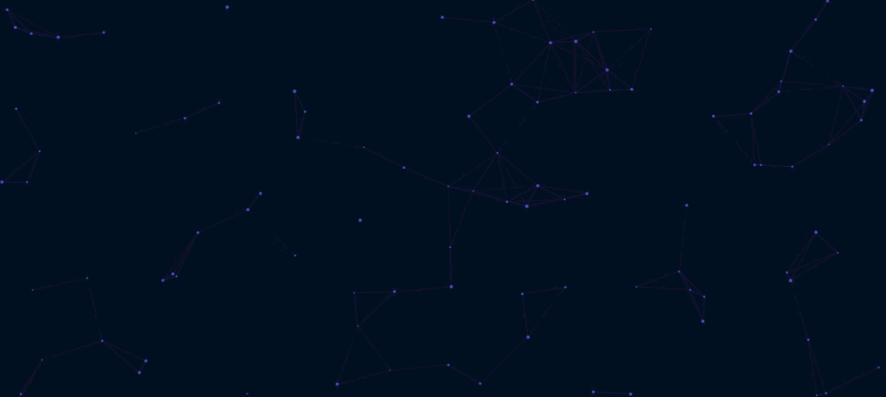

# Animated Network Background React Component

The animated network background features glowing nodes and connecting lines that slowly shift across the screen, evoking a sense of digital connectivity and data flow.

## Preview

## Installation & Setup

1. Create a file named `ParticleBackground.jsx` in your components directory.
2. Paste the component code into the file .
3. Import and render the component in your application.

# Customization Options

You can easily tweak the look and feel of your animated background by modifying the configuration variables and properties inside your component:

* **Background Color:** Change the `background: '#0f172a'` property in the canvas inline styles to adjust the primary backdrop color.
* **Particle Color:** Modify `ctx.fillStyle` and `ctx.strokeStyle` to change the color of the floating particles and their connecting lines (default is Indigo: `99, 102, 241`).
* **Particle Density:** Adjust the `particleCount` calculation (e.g., change the divisor `10` in `Math.min(window.innerWidth / 10, 100)` to a higher number for fewer particles, or a lower number for a denser effect).
* **Connection Range:** Modify the `connectionDistance` variable to increase or decrease how far apart particles can drift before their connecting lines disappear.
