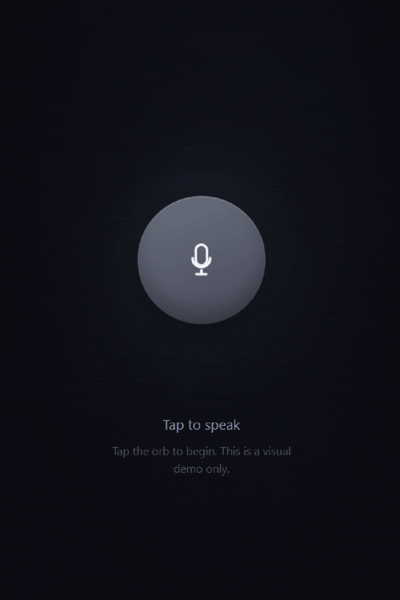

# VoiceOrb

A simple React voice assistant UI with an animated orb and microphone icon.




## Installation

Copy `VoiceOrb.jsx` into your React project.

Example:

```text
src/
└── components/
    └── VoiceOrb.jsx
```

## Usage

Import the component:

```jsx
import VoiceOrb from "./components/VoiceOrb";
```

Then use it:

```jsx
function App() {
  return <VoiceOrb />;
}

export default App;
```


## Important

This is currently a **UI component only**.

It does not include:

* Speech recognition
* Microphone access
* AI responses
* Text-to-speech
* Backend connection
* API calls
* Internet access


## License

Free to use and modify for your project.
