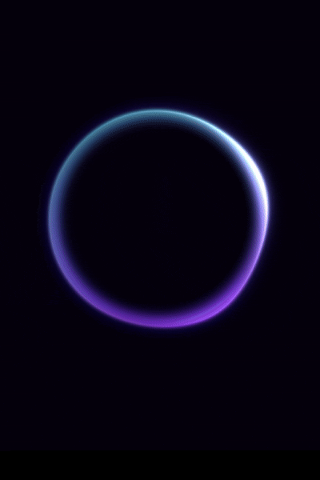

# Orb

A beautiful animated WebGL orb built with **React** and **OGL**.

The orb features smooth movement, colorful gradients, interactive hover effects, and automatic animation.



## Requirements

* React
* OGL

Install OGL:

```bash
npm install ogl
```

## Usage

Import the component:

```jsx
import Orb from "./Orb";
```

Use it inside your application:

```jsx
function App() {
  return <Orb />;
}

export default App;
```

## Props

The component supports four optional props:
            

Example:

```jsx
<Orb
  hue={20}
  hoverIntensity={0.5}
  rotateOnHover={true}
  forceHoverState={false}
/>
```

## CSS

The orb size is controlled by `.orb-container`.

You can change the size:

```css
.orb-container {
  width: 1000px;
  height: 1000px;
}
```


